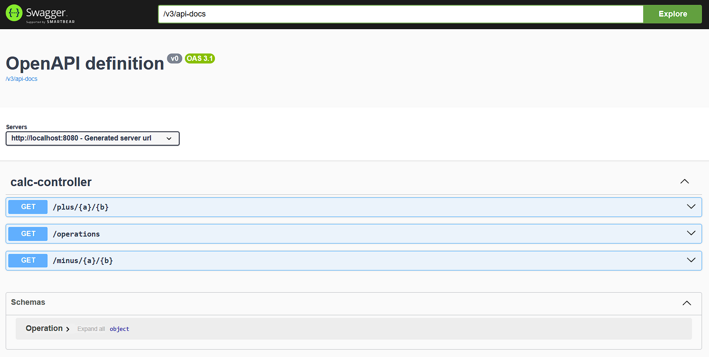
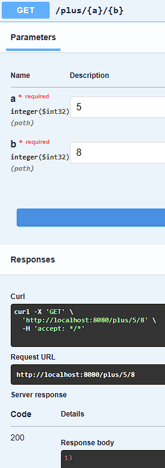
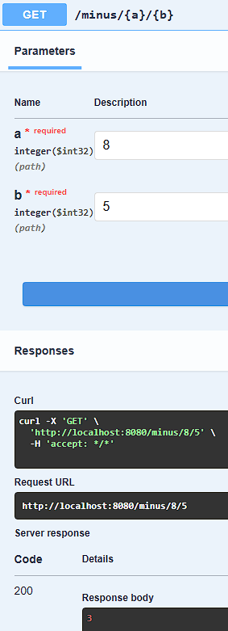
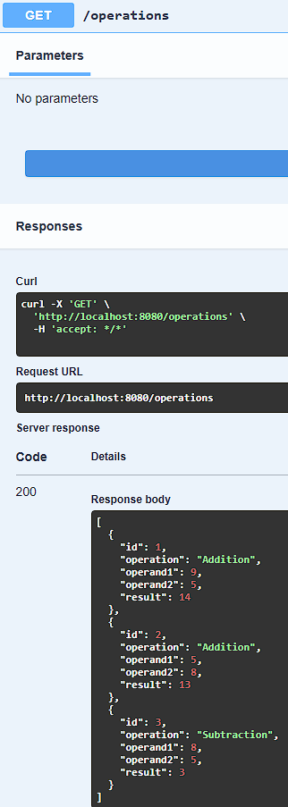
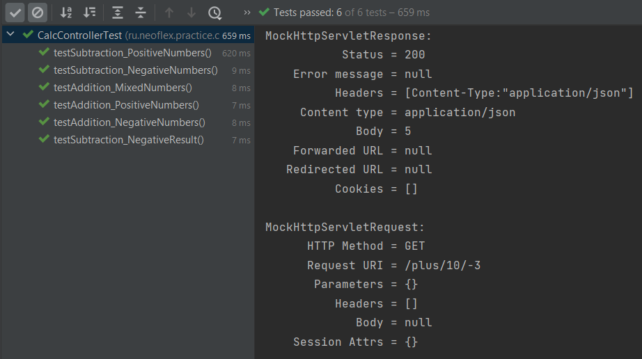

# Задание 1. Backend. Онлайн калькулятор на микросервисной архитектуре

## Задание 
1.  В среде Intellij IDEA Ultimate и используя Spring Framework Java написать клиент серверное приложение с микросервисной архитектурой. 
2.  Сервер должен принимать два аргумента и возвращать их сумму/разность.
3.  Сгенерировать веб-интерфейс для ваших SpringBoot API с помощью Swagger 3.0.0.
4.  (*) Написать тесты на проект.
5.  (**) Подключить in-memory БД и сохранять туда все результаты расчетов калькулятора.
6.  (***) Добавить еще одну API, которая по GET-запросу будет возвращать все сохранённые записи в БД.

## Задачи
 - [x] Установить и настроить Intellij IDEA
 - [x] Сконфигурировать проект в сервисе (https://start.spring.io/)
 - [x] Настроить проект в Intellij IDEA, установить недостающие зависимости
 - [x] Написать класс Controller с необходимыми методами
 - [x] Подключить Swagger для генерации интерфейса запросов
 - [x] Подключить in-memory БД
 - [x] Добавить еще одну API, которая по GET-запросу будет возвращать все сохранённые записи в БД
 - [x] Написать тесты на проект

## Эндпоинты в Swagger UI

### Эндпоинт "plus"

### Эндпоинт "minus"

### Эндпоинт "operations"

## Тестирование с помощью MockMvc

