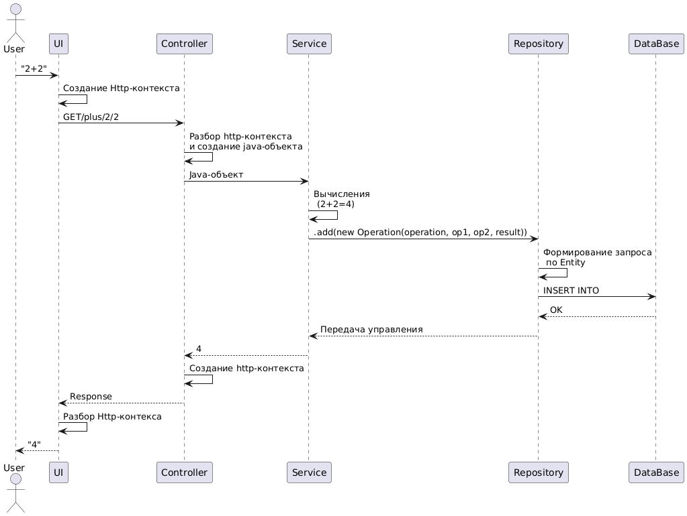

# Analytics

## Задание
1.  Описать какие бывают требования к программному продукту. 
2.  Придумать функциональные нефункциональные требования к онлайн калькулятору на микросервисной архитектуре. Не менее 10.
3.  Описать какие источники требований бывают. Написать заинтересованные лица для калькулятора.  
4.  Описать какие методы сбора требований бывают? Дать примеры. 
5.  Написать 5 User Story и 5 Use Case.
6.  Прочитать про диаграмму последовательности: https://plantuml.com/ru/sequence-diagram.
7.  Создать диаграмму последовательности работы онлайн калькулятора в PlantUML http://www.plantuml.com/plantuml/uml.
8.  \* Изучить нотацию BPMN: https://www.businessstudio.ru/wiki/docs/v4/doku.php/ru/csdesign/bpmodeling/bpmn_notation 
9.  ** Отрисовать в Camunda бизнес-процессы для онлайн калькулятора, 3 варианта, желательно с использованием дорожек и подпроцессов.

## Требования к программному продукт
Требования к программному обеспечению (ПО) делятся на категории, которые определяют функциональность, качество и ограничения продукта.

**Бизнес‑требование** — Высокоуровневая бизнес‑цель организации или заказчиков системы

**Бизнес‑правило** — Политика, предписание, стандарт или правило, определяющее или ограничивающее некоторые стороны бизнес‑процессов. По своей сути это не требование к ПО, но оно служит источником нескольких типов требований к ПО

**Ограничение** — Ограничение на выбор вариантов, доступных разработчику при проектировании и разработке продукта

**Внешнее требование к интерфейсу** — Описание взаимодействия между ПО и пользователем, другой программной системой или устройством

**Характеристика** — Одна или несколько логически связанных возможностей системы, которые представляют ценность для пользователя и описаны рядом функциональных требований

**Функциональное требование** — Описание требуемого поведения системы в определенных условиях

**Нефункциональное требование** — Описание свойства или особенности, которым должна обладать система, или ограничение, которое должна соблюдать система

**Атрибут качества** — Вид нефункционального требования, описывающего характеристику сервиса или производительности продукта

**Системное требование** — Требование верхнего уровня к продукту, состоящему из многих подсистем, которые могут представлять собой ПО или совокупность ПО и оборудования

**Пользовательское требование** — Задача, которую определенные классы пользователей должны иметь возможность выполнять в системе, или требуемый атрибут продукта

## Функциональные и нефункциональные требования к онлайн калькулятору на микросервисной архитектуре

### Функциональные требования (Что система делает)

**Выполнение базовых арифметических операций:** Микросервис CalcService должен поддерживать Сложение (/plus/{a}/{b}) и Вычитание (/minus/{a}/{b}) с двумя операндами

**Валидация входных данных:** Каждый микросервис должен проверять корректность входных параметров (например, проверка на число) и возвращать понятные ошибки

**Ведение истории вычислений:** Микросервис должен сохранять каждую успешную операцию (саму операцию, операнды, результат) в базу данных

**Предоставление истории вычислений:** Микросервис должен предоставлять API для получения данных о совершенных операциях

### Нефункциональные требования (Как система это делает)

- **Производительность и низкая задержка (Latency):**
  - **Требование:** 99% всех запросов на вычисление должны выполняться менее чем за 100 мс. Ответ API Gateway на пользовательский запрос не должен превышать 200 мс.

- **Масштабируемость (Scalability):**
  - **Требование:** Микросервис должен иметь возможность горизонтального масштабирования (запуск новых копий в контейнерах)

- **Доступность (Availability):**
  - **Требование:** Общее время доступности (uptime) системы должно составлять 99.95%

- **Отказоустойчивость (Resilience):**
  - **Требование:** Если микросервис временно недоступен, это не должно блокировать выполнение вычислений. При сбое H2 возвращать последнее сохранённое состояние

- **Безопасность (Security):**
  - **Требование:** Все данные, передаваемые между клиентом и API Gateway, должны быть защищены с помощью протокола HTTPS

- **Совместимость (Compatibility):**
  - **Требование:** Публичное API должно поддерживать версионирование (например, /api/v1/calculate) и быть обратно совместимым в течение как минимум 12 месяцев с момента выпуска новой версии

- **Простота развертывания (Deployability):**
  - **Требование:** Процесс развертывания любого микросервиса должен быть автоматизирован с помощью CI/CD пайплайна

## Источники требований и заинтересованные лица для онлайн-калькулятора

### Источники требований

- **Бизнес-требования**
  - Цели кафедры (развитие навыков студентов)
  - План практики

- **Пользовательские потребности**
  - Обратная связь от студентов
  - Анализ учебных задач
  - Анализ поведения пользователей

- **Нормативные документы**
  - Внутренние стандарты СПбГУАП
  - Требования к отчетности

- **Технические ограничения**
  - Возможности Spring Boot и H2
  - Локальная инфраструктура

- **Конкуренты**
  - Анализ онлайн-калькуляторов (Google, Wolfram)
 
### Заинтересованные лица

| Роль              | Интерес/влияние                     |
|-------------------|-------------------------------------|
| **Студенты**      | Простота использования              |
| **Преподаватели** | Соответствие учебным целям          |
| **Разработчики**  | Стабильность кода и API             |
| **Руководитель**  | Своевременная сдача отчета          |

## Методы сбора требований к программному обеспечению

**1. Методы исследования и взаимодействия с людьми** 
Эти методы направлены на прямое общение с пользователями и заинтересованными лицами для выявления их скрытых и явных потребностей.

- **Интервью (Interviewing):**
    - **Что это:** Структурированная, полуструктурированная или неформальная беседа один-на-один.
    - **Зачем:** Чтобы глубоко понять точку зрения конкретного стейкхолдера, его боль, мотивацию и контекст использования.
    - **Пример:** Интервью с бухгалтером о том, какие финансовые расчеты он выполняет ежедневно и какие ошибки чаще всего возникают.

- **Опросы и анкетирование (Surveys & Questionnaires):**
  - **Что это:** Массовый сбор количественных и качественных данных от большой группы людей.
  - **Зачем:** Чтобы выявить общие тенденции, предпочтения и статистику среди широкой аудитории. Идеально, когда нужно опросить много людей за короткое время.
  - **Пример:** Онлайн-опрос для студентов и инженеров о том, какие математические функции (интегралы, статистика, преобразование единиц) они используют чаще всего.

- **Фокус-группы (Focus Groups):**
  - **Что это:** Модераторская дискуссия в группе из 6-10 представителей целевой аудитории.
  - **Зачем:** Чтобы получить коллективное мнение, обсудить идеи и понаблюдать за взаимодействием и спорами между участниками. Позволяет выявить противоречия.
  - **Пример:** Обсуждение с группой учителей математики, как они видят идеальный калькулятор для использования на уроках.

- **Наблюдение (Ethnography/Shadowing):**
  - **Что это:** Непосредственное наблюдение за пользователями в их естественной рабочей среде, когда они выполняют реальные задачи.
  - **Зачем:** Чтобы увидеть фактические процессы, а не те, что описаны в документах. Позволяет обнаружить неочевидные проблемы и "костыли".
  - **Пример:** Наблюдение за тем, как трейдер использует сразу несколько калькуляторов, эксель и бумажный блокнот для расчета сделок. Это может выявить потребность в объединении всех функций в одном инструменте.

- **Воркшопы по извлечению требований (Requirements Workshops):**
  - **Что это:** Структурированные коллективные встречи ключевых стейкхолдеров (заказчики, пользователи, разработчики, аналитики).
  - **Зачем:** Для быстрого принятия решений, выявления противоречий и совместной выработки требований. Часто используется в Agile-подходах.
  - **Пример:** Проведение сессии Event Storming для совместного проектирования процесса выполнения вычисления и сохранения истории.

**2. Методы анализа данных и документов** 
Эти методы используются для изучения существующей информации о системе и бизнес-процессах.

- **Анализ существующей документации (Document Analysis):**
  - **Что это:** Изучение бизнес-планов, договоров, руководств пользователя, технической документации старой системы, стандартов работы.
  - **Зачем:** Чтобы понять текущее состояние дел, бизнес-правила и ограничения, не отвлекая экспертов на базовые вопросы.
  - **Пример:** Анализ технической документации на устаревший калькулятор, чтобы понять, какие алгоритмы вычислений нужно перенести в новую систему.

- **Анализ конкурентов (Competitive Analysis):**
  - **Что это:** Системное изучение продуктов прямых и косвенных конкурентов.
  - **Зачем:** Чтобы понять отраслевые стандарты, выявить лучшие практики и найти возможности сделать свой продукт лучше.
  - **Пример:** Изучение калькуляторов Photomath и WolframAlpha для переноса их уникальных функций (решение уравнений по фото, пошаговые решения).

- **Анализ прототипов (Prototype Analysis):**
  - **Что это:** Создание упрощенной, "сырой" версии продукта (макет интерфейса, MVP) для демонстрации заинтересованным лицам.
  - **Зачем:** Чтобы получить обратную связь на ранней стадии. Пользователям проще комментировать то, что они видят и могут "пощупать".
  - **Пример:** Создание интерактивного прототипа интерфейса калькулятора в Figma для проверки удобства расположения кнопок.

**3. Методы мозгового штурма и генерации идей** 

- **Мозговой штурм (Brainstorming):**
  - **Что это:** Групповая сессия по генерации как можно большего количества идей без их критики.
  - **Зачем:** Для поиска инновационных решений и выявления скрытых возможностей продукта.
  - **Пример:** Сессия с командой: "Какие 20 безумных функций мы могли бы добавить в калькулятор, чтобы он стал уникальным?".

- **User Stories (Пользовательские истории):**
  - **Что это:** Короткие, простые формулировки требований от лица пользователя в формате: "Как [роль], я хочу [цель], чтобы [выгода]".
  - **Зачем:** Чтобы сместить фокус с сухих характеристик на потребности пользователя и его ценность. Основа Agile-подходов.
  - **Пример:** "Как пользователь, я хочу видеть историю своих вычислений, чтобы мне не приходилось записывать результаты на бумаге".

## User Stories и Use Cases для онлайн-калькулятора

### User Stories

**US-1:** Простые вычисления
Как студент, я хочу вводить два числа для сложения/вычитания, чтобы не тратить время на ручные расчеты при решении домашних задач по физике.

**US-2:** История операций
Как бухгалтер, я хочу видеть историю всех моих последних вычислений, чтобы проверить свои расчеты и избежать ошибок в финансовом отчете.

**US-3:** Обработка ошибок
Как пользователь, я хочу получать уведомления об ошибках, чтобы исправлять ввод.

**US-4:** Доступ к API
Как разработчик, я хочу использовать задокументированное API, чтобы интегрировать калькулятор.

**US-5:** Управление данными
Как постоянный пользователь, я хочу иметь возможность очистить всю историю моих вычислений, чтобы сохранить свою конфиденциальность при работе на общем компьютере.

### User Case

#### UC-1: Выполнение сложения
- **Акторы:** Пользователь  
- **Предусловия:** Доступ к API   

**Основной поток:**
1. Пользователь отправляет `/plus/5/3`
2. Система вычисляет `8`
3. Сохраняет результат в H2
4. Возвращает `8`

#### UC-2: Просмотр истории
- **Акторы:** Авторизованный пользователь  
- **Предусловия:** Выполнено ≥1 вычисление 

**Основной поток:**
1. Пользователь запрашивает `/calculations`
2. Система возвращает список операций
3. Пользователь анализирует данные

#### UC-3: Обработка ошибки
- **Акторы:** Пользователь  
- **Предусловия:** Некорректный ввод 

**Основной поток:**
1. Пользователь отправляет `/plus/abc/3`
2. Система возвращает код 400
3. Показывает сообщение об ошибке

#### UC-4: Мониторинг нагрузки
- **Акторы:** Администратор  
- **Предусловия:** Настроен Actuator 

**Основной поток:**
1. Администратор запрашивает метрики
2. Система отображает статистику
3. Администратор принимает решение о масштабировании

#### UC-5: Сохранение операции
- **Акторы:** Система  
- **Предусловия:** Успешное вычисление 

**Основной поток:**
1. Система получает результат
2. Сохраняет данные в H2
3. Подтверждает сохранение

## Диаграмма последовательности (PlantUML)

