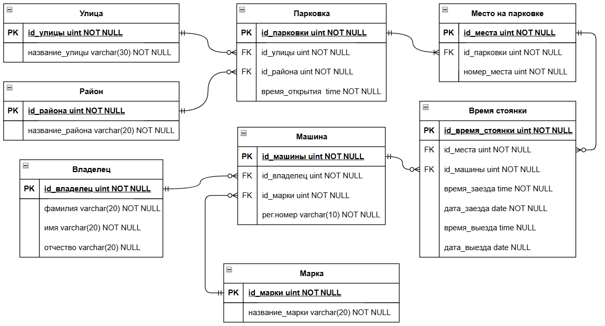
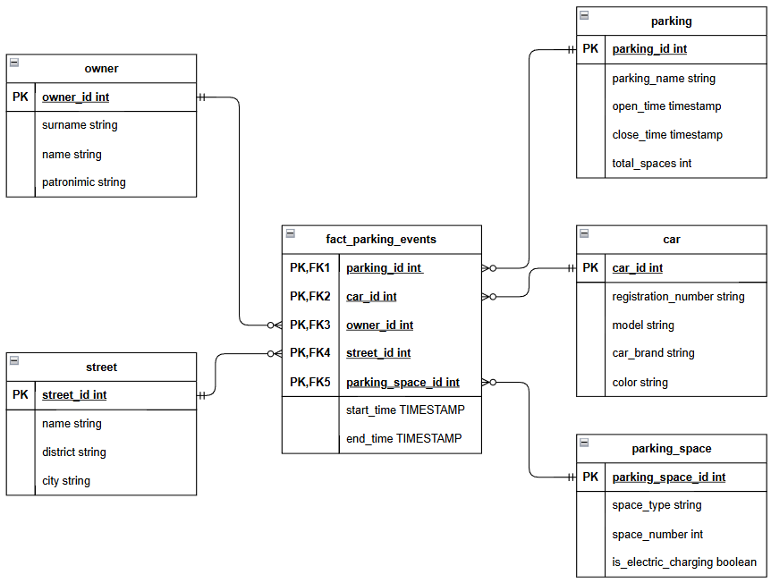
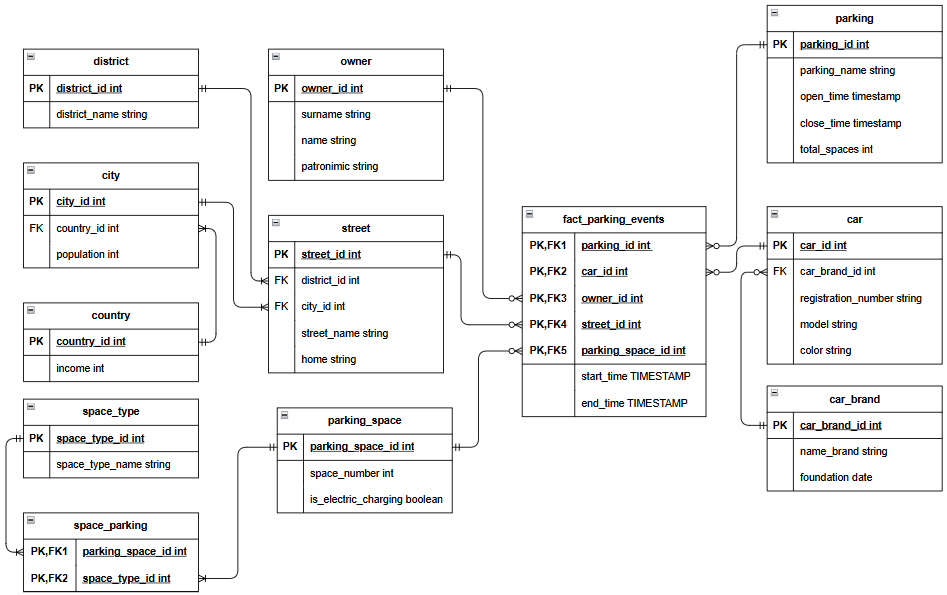
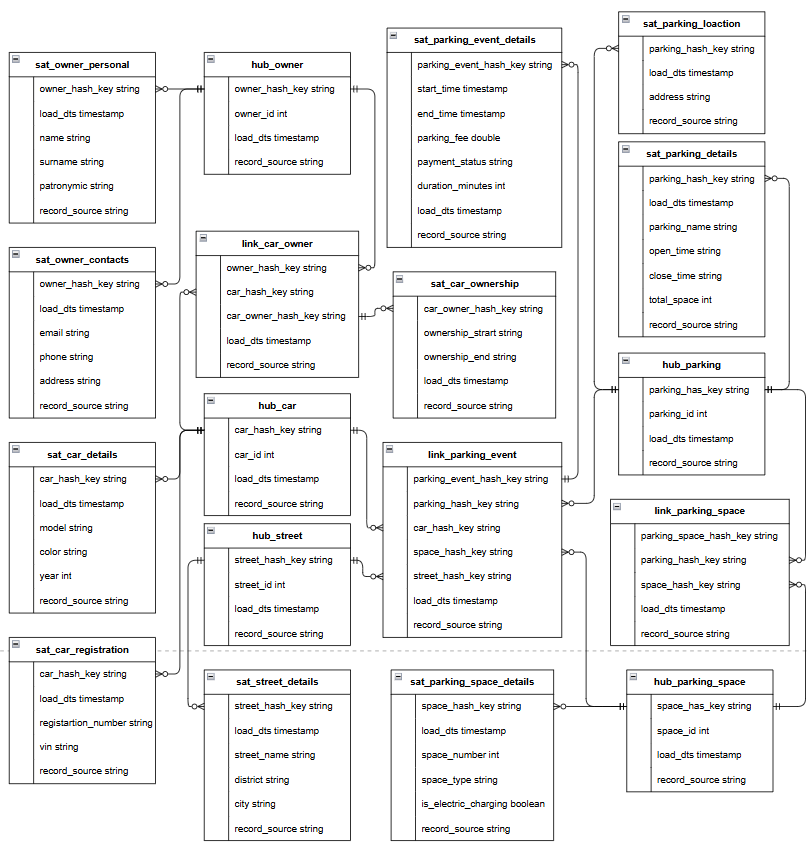

# Задание 3. Big Data

## Описание БД

Была выбрана база данных для хранения информации о стоянках на охраняемых парковках, о владельцах и их машин и хранения данных о самих парковках.

## Схема БД в 3НФ

### Скрипты
- [Скрипт создания БД и таблиц](secured_parking/create_secured_parking.sql)
- [Скрипт заполнения БД данными](secured_parking/insert_secured_parking.sql)
- [Скрипт выборки данных](secured_parking/select_secured_parking.sql)

### Примеры запросов
См. в папке screenshot.

## Модель "Star"

### Скрипты
- [Скрипт создания БД и таблиц](secured_parking_star/create_secured_parking_star.sql)
- [Скрипт заполнения БД данными](secured_parking_star/insert_secured_parking_star.sql)

## Модель "Snowflake"

### Скрипты
- [Скрипт создания БД и таблиц](secured_parking_snowflake/create_secured_parking_snowflake.sql)
- [Скрипт заполнения БД данными](secured_parking_snowflake/insert_secured_parking_snowflake.sql)

## Модель "Data Vault"

### Скрипты
- [Скрипт создания БД и таблиц](secured_parking_data_vault/create_secured_parking_data_vault.sql)
